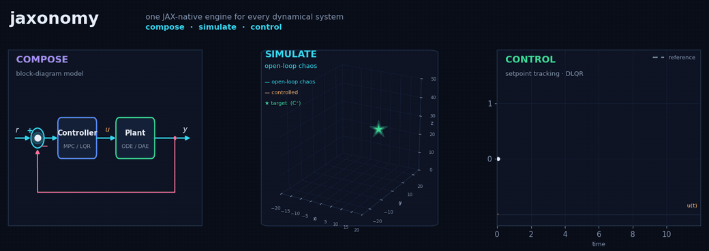
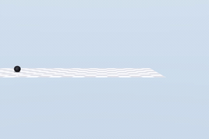
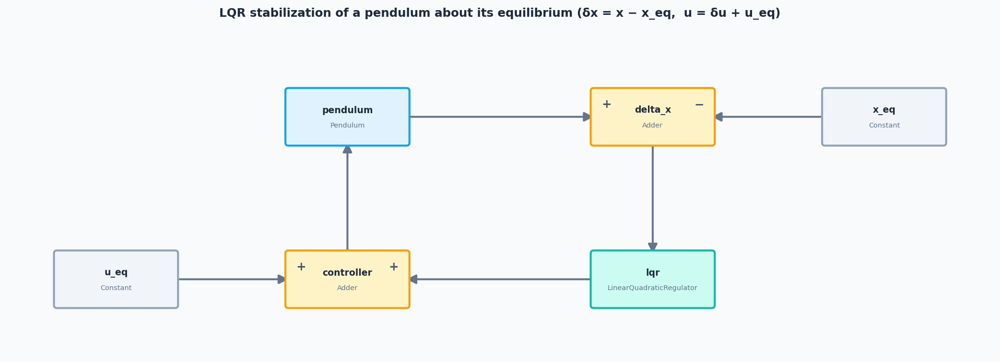
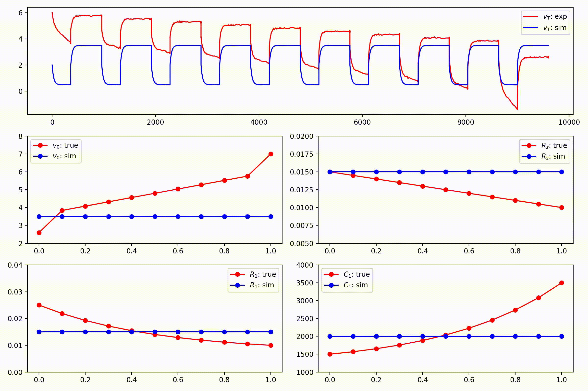
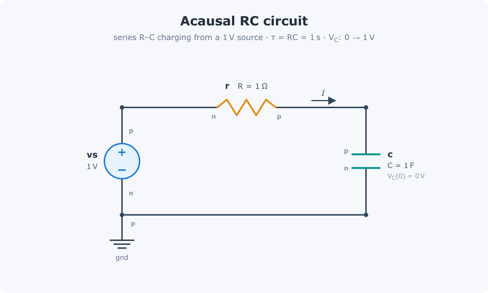
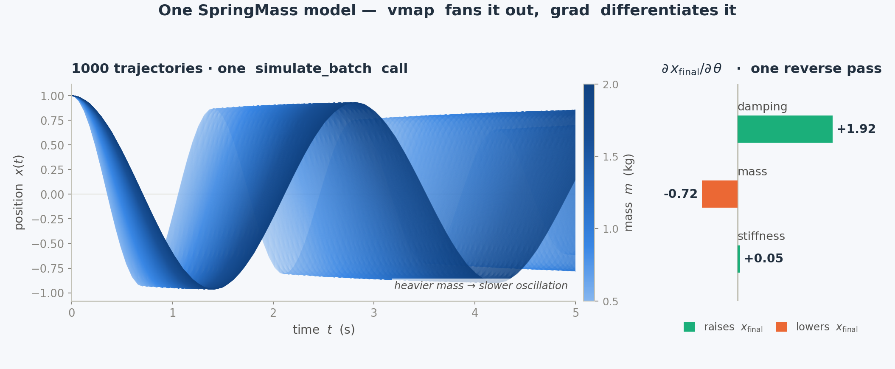
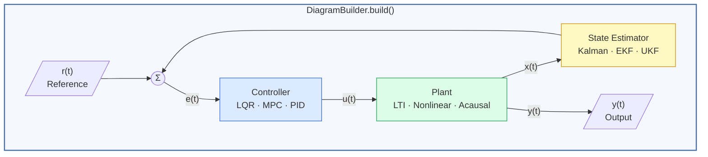
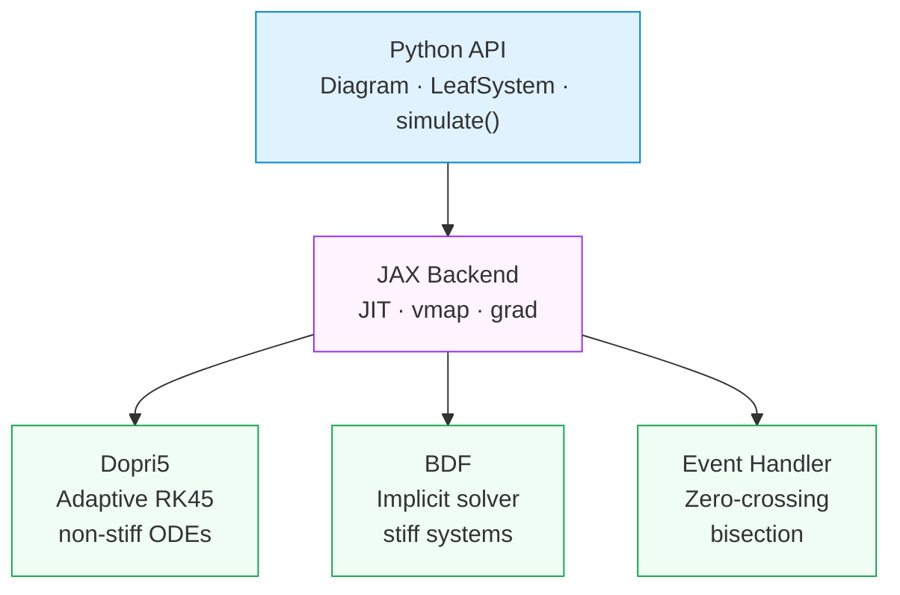

<div align="center">



# Jaxonomy

**Differentiable simulation of hybrid dynamical systems — powered by JAX.**

[](https://pypi.org/project/jaxonomy/)
[](https://www.python.org/)
[](LICENSE.md)
[](https://py.jaxonomy.com)

*Block diagrams meet automatic differentiation. Model physical systems, close the loop with LQR/MPC/Kalman, and differentiate through everything.*

**[Why JAX?](#-why-jax)** · **[Install](#-installation)** · **[Quick Start](#-quick-start)** · **[Gallery](#-gallery)** · **[Examples](#-examples)** · **[Docs](https://py.jaxonomy.com)**

<sub>Every panel above is produced by <code>jaxonomy.simulate</code> on a model built from the library.</sub>

</div>

---

## What is Jaxonomy?

Jaxonomy is a Python framework for modeling, simulating, and optimizing **hybrid dynamical systems** — systems that combine continuous physics, discrete control laws, and event-driven logic in a single model. Every simulation runs on **JAX**, so it is JIT-compilable, batchable with `vmap`, and **fully differentiable from end to end**.

```python
import jax.numpy as jnp
import jaxonomy as jx

# Double integrator: A, B, C, D define the plant; Q, R weight the LQR cost.
A, B = jnp.array([[0., 1.], [0., 0.]]), jnp.array([[0.], [1.]])
C, D = jnp.eye(2), jnp.zeros((2, 1))
Q, R = jnp.eye(2), jnp.array([[1.]])

builder = jx.DiagramBuilder()
plant      = builder.add(jx.library.LTISystem(A, B, C, D))
controller = builder.add(jx.library.LinearQuadraticRegulator(A, B, Q, R))
builder.connect(plant.output_ports[0],      controller.input_ports[0])
builder.connect(controller.output_ports[0], plant.input_ports[0])

diagram = builder.build()
results = jx.simulate(diagram, diagram.create_context(), (0.0, 10.0))
```

---

## 🔥 Why JAX?

Choosing JAX as the compute backbone unlocks capabilities that are impractical with NumPy-based simulators:

```
Traditional simulator          Jaxonomy / JAX
──────────────────────         ─────────────────────────────────────────
simulate(params)          →    jit(simulate)(params)          10–100× faster
for p in param_grid: …    →    vmap(simulate)(param_grid)     embarrassingly parallel
finite_diff_gradient(…)   →    grad(simulate)(params)         exact gradients, free
```

| Feature | SciPy / NumPy | Julia / DiffEq | Modelica | MathWorks¹ | **Jaxonomy** |
|---|:---:|:---:|:---:|:---:|:---:|
| Python-native | ✓ | ✗ | ✗ | ✗ | **✓** |
| JIT / code generation | ✗ | ✓ | ✓ (C++) | ✓ (C/C++) | **✓** |
| Full autodiff through ODE | ✗ | Partial | ✗ | Partial² | **✓** |
| Hybrid events & zero-crossing | Partial | ✓ | ✓ | ✓ | **✓** |
| Acausal / equation-based | ✗ | ✗ | ✓ | ✓ (Simscape) | **✓** |
| Block-diagram composition | ✗ | Partial | Partial | ✓ (Simulink) | **✓** |
| State-machine modeling | ✗ | ✗ | ✗ | ✓ (Stateflow) | **✓** |
| LQR / MPC / Kalman built-in | ✗ | Partial | Via libs | ✓ (Toolboxes) | **✓** |
| Neural ODE / SINDy | ✗ | ✓ | ✗ | ✗ | **✓** |
| Batch / ensemble (vmap) | ✗ | ✗ | ✗ | ✗ | **✓** |
| Open-source (MIT) | ✓ | ✓ | Partial | ✗ | **✓** |

<sub>¹ Simulink + Simscape + Stateflow + Control System Toolbox &nbsp;·&nbsp; ² Via Simulink Design Optimization, no end-to-end AD</sub>

---

## ⚡ Key Capabilities

| Capability | What it enables |
|---|---|
| ⚡ **JAX-native engine** | JIT-compile simulations, run ensembles with `vmap`, differentiate through ODE solvers including event handling |
| 🔀 **Hybrid dynamics + state machines** | Continuous ODEs, periodic discrete updates, zero-crossing events, and `StateMachineBuilder`-authored finite state machines composed in one model. `jax.grad` flows through event times for hybrid trajectory optimisation. |
| 🔌 **Acausal modeling** | Modelica-inspired multi-domain components (electrical, mechanical, thermal, fluid, battery) with Pantelides index reduction and a BDF mass-matrix DAE solver |
| 🎯 **Control & estimation** | LQR (continuous, discrete, finite-horizon, LQG), linear MPC (native + OSQP), nonlinear MPC (shooting / transcription / Hermite-Simpson), Kalman / EKF / UKF / RLS / Luenberger, 2-DOF PID with classical tuning helpers |
| 🧮 **Unit-aware wiring** | Optional `BusUnit` annotations on ports and signals; the diagram compiler catches dimensional mismatches at build time instead of as silent runtime bugs |
| 🧠 **Data-driven modeling** | Neural ODEs, Universal Differential Equations, SINDy symbolic regression, neural-network blocks (`MLP` / `PyTorch` / `TensorFlow` / `ONNX`), differentiable lookup-table fitting from data |
| 🎲 **Uncertainty & sensitivity** | First-class `jaxonomy.uq` workflow: Monte Carlo with parameter distributions, Latin Hypercube + quasi-Monte Carlo sampling, Sobol sensitivity decomposition, Morris screening |
| 🤝 **FMI 2.0 / 3.0 interop** | Import any FMI co-simulation FMU (`ModelicaFMU`) with mixed-type and array I/O; export a Jaxonomy diagram as a binary `.fmu` via `build_fmu` for use in Simulink / Dymola / OpenModelica |
| 🧩 **150+ library blocks** | Integrators, filters, state machines, look-up tables, coordinate transforms, container blocks, bus / mux family, stochastic sources, and more |

---

## 📦 Installation

Requires **Python 3.10+**.

```bash
# Create and activate a virtual environment (recommended)
python -m venv .venv
source .venv/bin/activate        # Windows: .venv\Scripts\activate

# Install
pip install jaxonomy             # core
pip install jaxonomy[safe]       # + SciPy, Matplotlib, control, jaxopt
pip install jaxonomy[nmpc]       # + nonlinear MPC (requires IPOPT on PATH)
pip install jaxonomy[all]        # + everything
```

**From source:**

```bash
git clone https://github.com/machinavitalis/jaxonomy
cd jaxonomy
pip install -e .
```

**CLI runner:**

```bash
jaxonomy_cli run --model path/to/model.json
```

---

## 🚀 Quick Start

A first simulation in a few lines — a custom block, built into a diagram, integrated through its ODE:

```python
import jaxonomy as jx
import jax.numpy as jnp

# Van der Pol oscillator as a custom block
class VanDerPol(jx.LeafSystem):
    def __init__(self, mu=1.0, **kwargs):
        super().__init__(**kwargs)
        self.declare_dynamic_parameter("mu", mu)
        self.declare_continuous_state(
            default_value=jnp.array([0.0, 2.0]), ode=self._ode
        )
        self.declare_continuous_state_output(name="x")

    def _ode(self, time, state, *inputs, **params):
        x, mu = state.continuous_state, params["mu"]
        return jnp.array([x[1],  mu * (1 - x[0]**2) * x[1] - x[0]])

builder = jx.DiagramBuilder()
vdp = builder.add(VanDerPol(mu=2.0, name="vdp"))
diagram = builder.build()

results = jx.simulate(
    diagram, diagram.create_context(), (0.0, 20.0),
    options=jx.SimulatorOptions(buffer_length=4000),  # room for adaptive steps
    recorded_signals={"x": vdp.output_ports[0]},
)
# results.outputs["x"] → time-series of shape (T, 2)
```

---

## 📚 Documentation

- **Online docs & tutorials:** [py.jaxonomy.com](https://py.jaxonomy.com)
- **Local docs:**
  ```bash
  pip install -r requirements.docs.txt
  mkdocs serve   # → http://127.0.0.1:8000
  ```
- **Example notebooks:** [`docs/examples/`](docs/examples/)

---

## 🤖 Driving Jaxonomy from an AI agent (MCP)

Jaxonomy ships an [MCP](https://modelcontextprotocol.io) server that exposes the
engine as tools an AI agent can call directly — it can enumerate library blocks,
build and validate a model, run a simulation, fit parameters to data, and
linearize a system, then reason over the actual results. This is worth wiring up
if you drive Jaxonomy from an agent (Claude Desktop/Code, Cursor, …); if you're
writing Python by hand, the `pip install` above is all you need and you can skip
this.

```bash
pip install jaxonomy[mcp]
```

Then register the server with your agent client. For Claude Desktop, add to
`claude_desktop_config.json`:

```json
{
  "mcpServers": {
    "jaxonomy": {
      "command": "python",
      "args": ["-m", "jaxonomy.mcp.server"]
    }
  }
}
```

Use the interpreter where `jaxonomy[mcp]` is installed (or the `jaxonomy-mcp`
entry point). Full tool reference and configuration notes:
[`jaxonomy/mcp/README.md`](jaxonomy/mcp/README.md).

---

## 📖 Examples

### 1 · Hybrid Dynamics: The Bouncing Ball

<div align="center">



</div>

Jaxonomy is designed for **hybrid systems** — models where continuous physics interacts with instantaneous discrete resets. The bouncing ball is the canonical example: free-fall ODE interrupted by a collision event that reverses velocity.

#### Governing equations

The dynamics between bounces follow:

$$
\dot{x} = v, \qquad \dot{v} = -g
$$

When the ball hits the ground ($x = 0$, $v < 0$) a zero-crossing event fires and the state resets:

$$
x^+ = 0, \qquad v^+ = -e \cdot v \quad (e \in [0, 1] \text{ — coefficient of restitution})
$$

```python
import jaxonomy as jx
import jax.numpy as jnp

class BouncingBall(jx.LeafSystem):
    def __init__(self, g=9.81, e=0.8, **kwargs):
        super().__init__(**kwargs)
        self.declare_dynamic_parameter("g", g)
        self.declare_dynamic_parameter("e", e)
        # [height, velocity]
        self.declare_continuous_state(
            default_value=jnp.array([5.0, 0.0]), ode=self._ode
        )
        self.declare_continuous_state_output(name="state")

        # Zero-crossing: fires as height crosses zero from above
        self.declare_zero_crossing(
            guard=self._hit_ground,
            reset_map=self._bounce,
            direction="positive_then_non_positive",
        )

    def _ode(self, time, state, *inputs, **params):
        v = state.continuous_state[1]
        return jnp.array([v, -params["g"]])

    def _hit_ground(self, time, state, *inputs, **params):
        return state.continuous_state[0]  # guard on height

    def _bounce(self, time, state, *inputs, **params):
        x, v = state.continuous_state
        new_state = jnp.array([0.0, -params["e"] * v])
        return state.with_continuous_state(new_state)

builder = jx.DiagramBuilder()
ball = builder.add(BouncingBall(g=9.81, e=0.85, name="ball"))
diagram  = builder.build()
results  = jx.simulate(
    diagram, diagram.create_context(), (0.0, 8.0),
    recorded_signals={"state": ball.output_ports[0]},
)
```

Zero-crossing events are located with **40-step bisection** on the solver's dense output polynomial — giving sub-microsecond temporal accuracy without user-specified tolerances.

---

### 2 · Optimal Control: LQR Pendulum

<div align="center">



</div>

For a linearized pendulum with state $x = [\theta, \dot\theta]^\top$:

$$
\dot{x} = Ax + Bu, \qquad
A = \begin{bmatrix} 0 & 1 \\ g/L & 0 \end{bmatrix}, \quad
B = \begin{bmatrix} 0 \\ 1/mL^2 \end{bmatrix}
$$

The **Linear Quadratic Regulator** minimizes infinite-horizon cost:

$$
J = \int_0^\infty \bigl( x^\top Q\, x + u^\top R\, u \bigr)\, dt
$$

by solving the algebraic Riccati equation $A^\top P + PA - PBR^{-1}B^\top P + Q = 0$ for the optimal gain $K = R^{-1}B^\top P$, so $u^* = -Kx$.

```python
import jaxonomy as jx
from jaxonomy.library import LTISystem, LinearQuadraticRegulator
import jax.numpy as jnp

g, L, m = 9.81, 1.0, 1.0
A = jnp.array([[0, 1], [g/L, 0]])
B = jnp.array([[0], [1 / (m * L**2)]])
C, D = jnp.eye(2), jnp.zeros((2, 1))

Q = jnp.diag(jnp.array([10.0, 1.0]))  # penalise angle more than rate
R = jnp.array([[0.1]])                 # control effort cost

builder    = jx.DiagramBuilder()
plant      = builder.add(LTISystem(A, B, C, D, name="pendulum"))
controller = builder.add(LinearQuadraticRegulator(A, B, Q, R, name="lqr"))

builder.connect(plant.output_ports[0],      controller.input_ports[0])
builder.connect(controller.output_ports[0], plant.input_ports[0])

diagram = builder.build()
context = diagram.create_context()

# Perturb the pendulum's initial angle by 15° (set one block's sub-state)
context = context.with_subcontext(
    plant.system_id,
    context[plant.system_id].with_continuous_state(jnp.array([jnp.pi / 12, 0.0])),
)

results = jx.simulate(
    diagram, context, (0.0, 5.0),
    recorded_signals={"x": plant.output_ports[0]},
)
```

---

### 3 · Differentiable Parameter Identification

<div align="center">



</div>

Jaxonomy can **differentiate through complete simulations** to fit model parameters to data — no finite-difference approximations, no hand-written adjoint code. Here we recover a spring–damper's stiffness and damping by differentiating the whole rollout and descending with [Optax](https://optax.readthedocs.io):

```python
import jax
import jax.numpy as jnp
import optax
import jaxonomy as jx

class SpringDamper(jx.LeafSystem):
    def __init__(self, k=1.0, c=0.3, **kwargs):
        super().__init__(**kwargs)
        self.declare_dynamic_parameter("k", k)
        self.declare_dynamic_parameter("c", c)
        self.declare_continuous_state(
            default_value=jnp.array([1.0, 0.0]), ode=self._ode
        )

    def _ode(self, time, state, *inputs, **params):
        x, v = state.continuous_state
        return jnp.array([v, -params["k"] * x - params["c"] * v])

sd   = SpringDamper(name="sd")
opts = jx.SimulatorOptions(enable_autodiff=True, max_major_steps=200)

def final_state(theta):                       # theta = {"k": ..., "c": ...}
    ctx = sd.create_context()
    ctx.parameters["k"], ctx.parameters["c"] = theta["k"], theta["c"]
    res = jx.simulate(sd, ctx, (0.0, 1.5), options=opts)
    return res.context.continuous_state       # differentiable final [x, v]

target = jax.lax.stop_gradient(final_state({"k": 4.0, "c": 0.5}))  # "measured"
loss   = lambda theta: jnp.sum((final_state(theta) - target) ** 2)

theta   = {"k": 1.0, "c": 0.1}
opt     = optax.adam(2e-1)
state   = opt.init(theta)
grad_fn = jax.jit(jax.grad(loss))             # gradient through the ODE solver
for _ in range(300):
    updates, state = opt.update(grad_fn(theta), state)
    theta = optax.apply_updates(theta, updates)
# theta → {"k": 4.00, "c": 0.50}
```

`jax.grad(loss)` flows back through every ODE step automatically, so the same recipe scales to battery ECMs (above), powertrains, or any parametric model — and `jaxonomy.optimization` wraps it in a higher-level `Optimizable` API when you want bounds, transforms, and constraints.

---

### 4 · Acausal Physical Modeling

<div align="center">



</div>

Jaxonomy includes a Modelica-inspired **acausal modeling layer** for multi-domain physical systems. You describe component connections symbolically; the compiler automatically derives the governing DAE, reduces its index, and emits a `LeafSystem` ready to drop into any diagram.

**RC circuit with initial conditions:**

$$
C\,\dot{V}_C = I, \qquad V_C(0) = 0\,\text{V}, \qquad V_{\text{src}} = 1\,\text{V}
$$

```python
import jaxonomy as jx
from jaxonomy.acausal import AcausalCompiler, AcausalDiagram, EqnEnv
from jaxonomy.acausal import electrical as elec

ev = EqnEnv()
ad = AcausalDiagram()

vs  = elec.VoltageSource(ev, name="vs", v=1.0)
r   = elec.Resistor(ev,      name="r",  R=1.0)
c   = elec.Capacitor(ev,     name="c",  C=1.0,
                              initial_voltage=0.0, initial_voltage_fixed=True)
gnd = elec.Ground(ev,        name="gnd")

ad.connect(vs, "p", r,  "n")
ad.connect(r,  "p", c,  "p")
ad.connect(c,  "n", vs, "n")
ad.connect(vs, "n", gnd, "p")

compiler = AcausalCompiler(ev, ad)
rc_block = compiler()         # → LeafSystem, JIT-compiled ODE

builder = jx.DiagramBuilder()
builder.add(rc_block)
diagram = builder.build()
results = jx.simulate(diagram, diagram.create_context(), (0.0, 5.0))
```

The same pipeline handles **multi-domain systems** — an electro-mechanical actuator connecting `electrical`, `rotational`, and `translational` domains compiles to a single optimized system.

Available acausal domains: `electrical` · `rotational` · `translational` · `thermal` · `fluid`

---

### 5 · Differentiable Sensitivity & Batch Simulation

<div align="center">



</div>

Because `jax.grad`, `jax.jit`, and `jax.vmap` all compose with `simulate`, you get powerful workflows with minimal boilerplate:

```python
import jax
import jax.numpy as jnp
import jaxonomy as jx

class SpringMass(jx.LeafSystem):
    def __init__(self, mass=1.0, damping=0.1, stiffness=10.0, **kwargs):
        super().__init__(**kwargs)
        self.declare_dynamic_parameter("mass", mass)
        self.declare_dynamic_parameter("damping", damping)
        self.declare_dynamic_parameter("stiffness", stiffness)
        self.declare_continuous_state(
            default_value=jnp.array([1.0, 0.0]), ode=self._ode
        )
        self.declare_continuous_state_output(name="x")

    def _ode(self, time, state, *inputs, **params):
        x, v = state.continuous_state
        a = -(params["stiffness"] * x + params["damping"] * v) / params["mass"]
        return jnp.array([v, a])

# ── Sensitivity: ∂(final position)/∂(all parameters) in one reverse pass ─────
plant = SpringMass(name="plant")
grad_opts = jx.SimulatorOptions(enable_autodiff=True, max_major_steps=200)

def final_position(theta):
    ctx = plant.create_context()
    for name, value in theta.items():
        ctx.parameters[name] = value
    res = jx.simulate(plant, ctx, (0.0, 5.0), options=grad_opts)
    return res.context.continuous_state[0]

grads = jax.grad(final_position)({"mass": 1.0, "damping": 0.1, "stiffness": 10.0})

# ── Monte Carlo ensemble: 1000 trajectories over a mass sweep (vmap) ─────────
builder = jx.DiagramBuilder()
plant_b = builder.add(SpringMass(name="plant"))
diagram = builder.build()

results = jx.simulate_batch(
    diagram, t_span=(0.0, 5.0),
    param_batches={"plant.mass": jnp.linspace(0.5, 2.0, 1000)},
    options=jx.SimulatorOptions(math_backend="jax", max_major_steps=200),
    recorded_signals={"x": plant_b.output_ports[0]},
)
# results.outputs["x"] shape: (1000, T, 2)
```

---

## 🧩 Library Overview

Over **150 built-in blocks** covering the full signal-processing and control toolkit. A representative slice — not exhaustive:

| Category | Blocks |
|---|---|
| **Sources** | `Constant`, `Step`, `Ramp`, `Chirp`, `Pulse`, `Sawtooth`, `Clock`, `DataSource` |
| **Stochastic** | `RandomNumber`, `UniformRandomNumber`, `WhiteNoise`, `BandLimitedNoise`, `PRBS`, `RandomSource` — all support `with_key` for independent noise streams under `vmap` |
| **Arithmetic & nonlinearities** | `Adder`, `Gain`, `Product`, `Abs`, `Power`, `Trigonometric`, `Saturate` / `SoftSaturate`, `DeadZone`, `RateLimiter` / `SoftRateLimiter`, `Quantizer`, `Backlash` |
| **Continuous dynamics** | `Integrator`, `Derivative`, `TransferFunction`, `LTISystem`, `PID` / `PIDContinuous` |
| **Discrete dynamics** | `IntegratorDiscrete`, `UnitDelay`, `FilterDiscrete`, `LowPassDiscrete`, `LeadLag`, `Notch`, `PIDDiscrete`, `PIDController2DOF`, `Decimator`, `RateTransition` |
| **Routing, buses, matrix** | `Mux` / `Demux`, `BusCreator` / `BusSelector` / `BusUpdate` (with `BusUnit` annotations), `Slice`, `Stack`, `Switch` / `MultiPortSwitch`, `IfThenElse`, `MatrixMultiplication`, `MatrixInversion`, `DotProduct`, `CrossProduct` |
| **Logic & state machines** | `TruthTable`, `LogicalOperator`, `Comparator`, `Relay`, `EdgeDetection`, `StateMachine` (authored via `StateMachineBuilder` DSL) |
| **Lookup tables** | `LookupTable1d` / `LookupTable2d` / `LookupTableND`, `Prelookup` / `InterpolationUsingPrelookup`, `TableSearch` — all differentiable and fittable from data via `fit_lookup_table_*` |
| **Delays & containers** | `TransportDelay`, `VariableTransportDelay`, `EnabledSubsystem`, `TriggeredSubsystem`, `ForEach`, `Conditional` |
| **Control** | `LinearQuadraticRegulator` / `DiscreteTimeLinearQuadraticRegulator` / `FiniteHorizonLinearQuadraticRegulator` / `LinearQuadraticGaussian`, `LinearDiscreteTimeMPC` (native + `LinearDiscreteTimeMPC_OSQP`), `DirectShootingNMPC` / `DirectTranscriptionNMPC` / `HermiteSimpsonNMPC` |
| **Estimation** | `KalmanFilter`, `ExtendedKalmanFilter`, `UnscentedKalmanFilter`, `InfiniteHorizonKalmanFilter`, `RecursiveLeastSquares`, `AugmentedStateEKF`, `Luenberger` |
| **Physics & coordinates** | `CoordinateRotation`, `RigidBody`, `BatteryCell` |
| **ML / Data** | `MLP` (Equinox), `Sindy`, `PyTorch`, `TensorFlow`, `ONNX` / `ONNXJax` |
| **Interop** | `ModelicaFMU` (FMI 2.0 / 3.0 co-simulation import) + FMU export via `build_fmu`; `MuJoCo` / `MJX`; `Ros2Publisher` / `Ros2Subscriber`; `QuanserHAL`; `PyTwin` |
| **Custom** | `CustomPythonBlock`, `CustomJaxBlock` for user-authored algorithms with persistent per-instance state |

Custom blocks are first-class beyond the wrappers above: subclass `LeafSystem`, declare ports and states, and your block integrates with the full framework including JIT, autodiff, and event detection.

---

## 🏗️ System Architecture

A Jaxonomy model is a **Diagram** — a directed graph of interconnected blocks. Blocks (`LeafSystem`) declare ports, continuous/discrete states, and event guards. The simulator orchestrates ODE integration, discrete updates, and event detection automatically.



The JAX backend sits underneath every simulation, giving you a clean Python API backed by XLA compilation:



---

## The Jaxonomy stack

Jaxonomy is the engine at the base of a three-package stack. Each package is its
own repository, MIT-licensed, and depends only on the package(s) above it:

- **Jaxonomy** — *this package.* The general-purpose, JAX-native simulation
  engine for hybrid dynamical systems. Not robotics-specific; depends on nothing
  else in the stack.
- **[Jaxterity](https://github.com/machinavitalis/jaxterity)** — the robotics
  layer built on top of Jaxonomy: URDF/MJCF import, MJX-backed articulated
  dynamics, calibrated actuators/sensors, system identification, and whole-body
  control. Imports Jaxonomy; never re-implements its primitives.
- **[Jaxility](https://github.com/machinavitalis/jaxility)** — the deployment
  artifact factory: compiles a calibrated robot to embedded C for Arm SoCs
  (Cortex-A / Cortex-M) with a signed attestation manifest. Consumes Jaxterity.

The boundary rule: anything useful to controls engineers *outside* robotics
(HVAC, battery, aerospace, energy) belongs in Jaxonomy; anything specific to
joints, actuators, contacts, and kinematic chains belongs in Jaxterity;
embedded codegen, targets, and attestation belong in Jaxility.

What Jaxonomy does **not** yet do (or does only partially) is tracked in
[`KNOWN_GAPS.md`](KNOWN_GAPS.md) — the public inverse of the internal evidence
ledger in `CLAIMS.md`.

## License

Released under the [MIT License](LICENSE.md) from version 2.2.0 onward.

Derived from the MIT-licensed open-source package **pycollimator** by **Collimator, Inc.**
</content>
</invoke>
